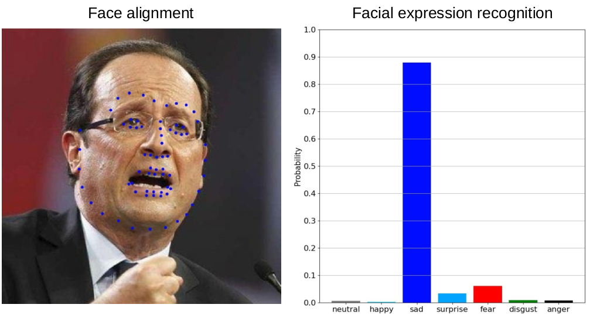

# ADEMFA: Adaptive Deep Ensemble Methods for Face Analysis In The Wild #



Code associated with following papers:
* [E. Arnaud, A. Dapogny, and K. Bailly, ”THIN: THrowable Information Networks and Application for Facial Expression Recognition In The Wild”, under review for <em>IEEE Transactions on Image Processing (TIP)</em>, 2020.](https://arxiv.org/pdf/2010.07614.pdf) 
* [E. Arnaud, A. Dapogny, K. Bailly. Tree-gated Deep Mixture-of-Experts For Pose-robust Face Alignment. <em>IEEE Transactions on Biometrics, Behavior, and Identity Science (TBIOM)</em>, 2019.](https://arxiv.org/pdf/1910.09450.pdf) 
* [E. Arnaud, A. Dapogny, K. Bailly. Tree-gated Deep Regressor Ensemble For Face Alignment In The Wild. <em>IEEE International Conference on Automatic Face and Gesture Recognition (FG)</em>, 2019.](https://arxiv.org/pdf/1907.03248.pdf) 

## Environment ##

Python 3.8.5 \
TensorFlow 2.4. \
OpenCV 4.4. \
Face detection using Viola-Jones algorithm.

## Docker ##

```sh
# Clone repository.
git clone https://github.com/estephe-arnaud/ademfa && cd ademfa

# Build the docker image.
docker build -t ademfa .

# Start an interactive bash session.
docker run -it ademfa bash
```

## Images ##
```sh
python ./face_analysis.py --task="facial_expression_recognition" --path="./data/vggface2.jpg"
python ./face_analysis.py --task="face_alignment" --path="./data/vggface2.jpg"
```

## Camera ##
```sh
python ./face_analysis.py --task="facial_expression_recognition" --camera
python ./face_analysis.py --task="face_alignment" --camera
```

## Prediction ##
Image: numpy.ndarray, without batch axis.

### Facial expression recognition
```python
import facial_expression_recognition.predictor
import facial_expression_recognition.utils

predictor = facial_expression_recognition.predictor.Predictor()

prediction = predictor.predict(image=image)
image = facial_expression_recognition.utils.draw(image, prediction)
```

### Face alignment
```python
import face_alignment.predictor
import face_alignment.utils

predictor = face_alignment.predictor.Predictor()

prediction = predictor.predict(image=image)
image = face_alignment.utils.draw(image, prediction)
```


## License ##
This project is licensed under the terms of BSD-3-Clause License.
By downloading this program, you commit to comply with the license as stated in the LICENSE file.


## Contact ##
If you have any questions or suggestions feel free to contact me at <arnaud@isir.upmc.fr>.
